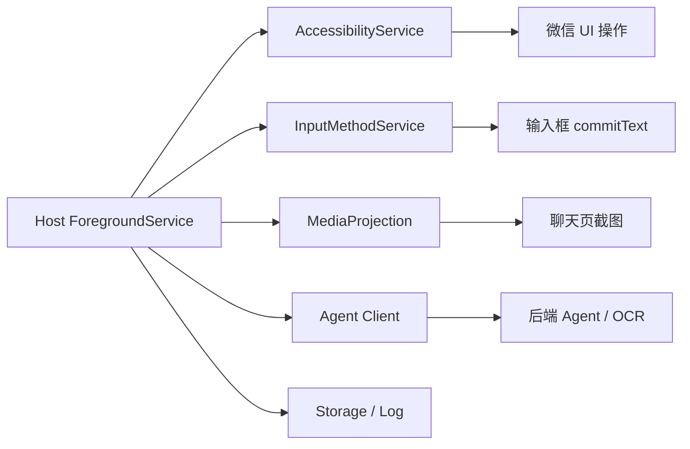

# Agent IME 升级开发方案

## 目标

将现有 **Agent IME（输入法 APK）** 升级为一个可独立运行的 **自有安卓宿主 App**，逐步替代当前 `Auto.js` 的执行层能力，服务“个人微信代聊”PoC。

目标闭环：

1. 启动微信
2. 打开并保持在目标聊天页
3. 截图当前聊天区域
4. OCR/后端识别最近消息
5. 调用 Agent 获取 `reply_text`
6. 通过输入法向当前输入框注入文本
7. 自动点击发送

## 当前基础

当前已验证能力：

- 现有 `Agent IME` 已可通过 `InputConnection.commitText()` 注入文本
- 已支持显式广播触发注入：
  - Action：`com.agentime.ime.action.INJECT_TEXT`
  - Receiver：`com.agentime.ime/.InjectTextReceiver`
- 已通过实验验证：
  - 微信输入框可聚焦
  - 注入文本成功
  - 发送按钮坐标已测通

当前痛点：

- 新版微信无障碍节点树极少，不适合继续依赖 `Auto.js` 做复杂页面识别与输入框写入
- `Auto.js` 目前更像“基础执行器”，已不适合长期作为主宿主

## 升级方向

不是把所有功能“塞进输入法类”，而是将 `Agent IME` 升级为：

**一个以输入法能力为核心的安卓自动化宿主 App**

输入法仍负责“文本注入”，但宿主 App 还应增加：

- UI 自动化能力
- 截屏能力
- 调度能力
- 网络通信能力
- 状态与日志能力

## 总体架构



## 模块划分

### 1. IME 模块

职责：

- 作为系统输入法
- 获取当前 `InputConnection`
- 调用 `commitText()` 注入文本
- 提供统一注入入口（广播 / 本地接口）

现状：

- 当前已具备基础能力
- 这是本项目最稳定、最核心的模块

### 2. Automation 模块

建议组件：`AccessibilityService`

职责：

- 启动微信
- 检查微信是否在前台
- 点击聊天输入框
- 点击发送按钮
- 后续扩展：
  - 切换联系人
  - 检测聊天页标题
  - 检测未读状态

### 3. Capture 模块

建议组件：`MediaProjection`

职责：

- 截取微信当前页面
- 后续可扩展聊天区裁剪
- 输出截图给 OCR / Agent 模块

### 4. Agent 模块

职责：

- 调用现有后端接口
- 上传截图
- 获取 `reply_text`
- 处理超时、失败、重试

现阶段建议：

- 继续复用现有后端
- 不立即迁移 OCR 到本地

### 5. Orchestrator 模块

建议组件：`ForegroundService`

职责：

- 串联完整链路
- 维护状态机
- 控制调用顺序
- 处理失败回退
- 管理统一日志

### 6. Storage / Log 模块

职责：

- 保存执行日志
- 保存最近截图路径
- 保存最近一次 `reply_text`
- 保存会话状态与错误信息

## 推荐 Android 组件设计

- `AgentImeService`
  - 输入法注入
- `InjectTextReceiver`
  - 兼容当前广播调用
- `WechatAccessibilityService`
  - 微信 UI 自动化
- `HostForegroundService`
  - 主调度器
- `CaptureManager`
  - 截屏管理
- `AgentClient`
  - 后端通信
- `MainActivity`
  - 权限引导、设置页、调试页

## 开发阶段规划

### Phase 1：迁移执行层

目标：

- 不改业务链路，只把 `Auto.js` 的 UI 执行能力迁到安卓原生

实现：

- 新增 `WechatAccessibilityService`
- 实现：
  - `launchWechat()`
  - `focusInputArea()`
  - `clickSend()`

验收：

- 不依赖 `Auto.js`
- 宿主 App 可完成：
  - 打开微信
  - 聚焦输入区
  - 点击发送

### Phase 2：保留现有 IME 注入能力

目标：

- 继续复用现有输入法模块

实现：

- `InjectTextReceiver` 保持兼容
- 新增统一接口：
  - `injectText(text)`

验收：

- 在微信聊天页中，宿主 App 可调用 IME 注入文本

### Phase 3：加入后端联调

目标：

- 在宿主内完成：
  - 截图
  - 调后端
  - 取 `reply_text`
  - 注入并发送

实现：

- 新增 `AgentClient`
- 新增截图能力
- 串联到 `HostForegroundService`

验收：

- 一次任务中完成：
  - 截图
  - 上传
  - 拿回复
  - 注入
  - 发送

### Phase 4：状态机与稳定性

建议状态：

- `IDLE`
- `WECHAT_READY`
- `INPUT_FOCUSED`
- `SCREEN_CAPTURED`
- `REPLY_READY`
- `TEXT_INJECTED`
- `SENT`
- `FAILED`

目标：

- 支持失败回退
- 支持日志追踪
- 支持重试

### Phase 5：本地 OCR（可选）

目标：

- 后续如需提升隐私和速度，可将 OCR 下沉到本地

建议：

- 先定义统一接口：
  - `OcrProvider`
- 初期默认：
  - `RemoteOcrProvider`
- 后续可增加：
  - `LocalOcrProvider`

## 推荐目录结构

```text
agent-host/
  app/
    src/main/java/...
      ime/
      automation/
      capture/
      agent/
      orchestrator/
      storage/
      ui/
      util/
```

## 关键接口建议

### AutomationController

- `launchWechat()`
- `isWechatForeground()`
- `focusInputArea()`
- `clickSend()`

### ImeController

- `injectText(text: String)`
- `isImeActive()`

### CaptureController

- `captureScreen()`

### AgentClient

- `chat(image, sessionId, contactName)`

### HostOrchestrator

- `runOnce(sessionId, contactName)`

## 最小闭环伪代码

```kotlin
runOnce(sessionId, contactName) {
  launchWechat()
  ensureWechatForeground()

  focusInputArea()
  ensureImeActive()

  val screenshot = captureScreen()
  val reply = agentClient.chat(screenshot, sessionId, contactName)

  if (reply.replyText.isBlank()) return

  injectText(reply.replyText)
  clickSend()

  saveLog()
}
```

## 当前阶段不建议立即做

- 多联系人自动切换
- 自动扫描未读列表
- 本地大模型
- 本地 OCR 优化
- 复杂设置页
- 多账号支持
- 图片/语音消息自动回复

先把单聊天页闭环稳定做完。

## 当前结论

当前 `Agent IME` 已经验证了最关键的一步：**文本注入可行**。

接下来最合理的升级方式不是继续增强 `Auto.js`，而是：

**以 Agent IME 为核心，构建一个原生安卓宿主 App，逐步接管微信代聊所需的基础执行能力。**

