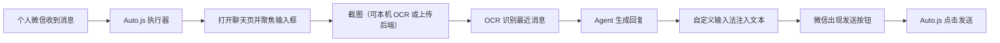

# 个人微信代聊技术方案

## 目标

实现“个人微信号代聊”PoC：

- 别人给我的个人微信发消息
- 系统自动读取聊天内容
- 调用后端 Agent 生成回复
- 自动把回复发送出去

注意：这里要的是“个人号代聊”，不是“微信 Bot 聊天”。

## 已验证结论

### 已打通

- `Auto.js` 基础运行正常
- 能启动微信
- 能手动进入某个联系人聊天页后截图
- 能把截图上传到后端
- 后端接口能返回 `reply_text`
- 能通过点击让微信输入框进入聚焦状态

### 已确认不可行/不稳定

- `OpenClaw / iLink` 方案本质是和 Bot 账号聊天，不是接管个人微信现有会话
- 新版微信在当前设备上几乎拿不到有效无障碍节点树
- 通过 `setText()`、`input()`、长按粘贴等方式，无法稳定把文本写入微信输入框
- `ADBKeyBoard` 方案不适合当前场景：即使能注入文本，也未必能让微信进入稳定的“文本输入态”，发送按钮不一定出现

## 当前技术判断

当前问题已经不在：

- Agent
- 后端接口
- 微信页面打开

而是在：

- **如何把文字稳定写进微信输入框**

由于微信新版对无障碍和节点树支持极差，继续在 `Auto.js + 无障碍写入` 这条路上投入，性价比很低。

## 推荐方案

改为：

### `Auto.js + 自定义输入法 + 后端 Agent`

核心链路：

1. Auto.js 打开微信聊天页
2. Auto.js 点击输入框，使微信进入文本输入态
3. 使用自定义输入法作为当前输入法
4. 后端 Agent 返回回复文本
5. 自定义输入法通过 `commitText()` 把文本注入当前输入框
6. 微信右下角自然出现发送按钮
7. Auto.js 点击右下角发送按钮

## 架构图

## 为什么选自定义输入法

相比继续硬搞 Auto.js 写输入框：

- 不依赖微信节点树
- 不依赖粘贴按钮
- 不依赖 `setText()`
- 更符合微信对“正常输入行为”的识别逻辑
- 能支持中文输入

## 实施路线

### 第 1 阶段：最小可行验证

- 保持当前后端接口不变
- 开发一个最小安卓输入法 APK
- 输入法只需要支持一个能力：`commitText(text)`
- Auto.js 继续负责：
  - 打开聊天页
  - 点击输入框
  - 点击发送按钮

### 第 2 阶段：输入法与后端联动

- 自定义输入法暴露一个本地调用方式：
  - 广播
  - 本地 HTTP
  - WebSocket
- Auto.js 或本地中控拿到 `reply_text` 后，发给输入法

### 第 3 阶段：全自动会话处理

- 监听微信通知
- 自动进入指定会话
- 截图并 OCR
- 自动生成回复
- 自动注入并发送

## 备选路线

如果短期不想开发输入法，可保留以下路线作为临时 PoC：

### `Auto.js + OCR + 坐标点击 + 手动确认发送`

即：

- 自动生成回复草稿
- 自动填充到中间面板或悬浮窗
- 人工确认后再发送

此方案可以更快验证业务流程，但不算完全自动代聊。

## 补充：OCR 放在本机（agent-ime APK）

若不希望截图上传云端识别，可在 **同一套自定义输入法 APK** 内使用 **设备端 OCR**（当前实现为 ML Kit 中文识别）：Auto.js 截图并保存为文件或 URI 后，通过广播交给 APK，识别结果再以广播返回，再由脚本调用后端 Agent。详见 [agent-ime输入法APK说明.md](./agent-ime输入法APK说明.md) 中的「广播协议（聊天截图 OCR）」。

## 当前结论

对于“个人微信代聊”这个目标：

- `Bot 方案` 不符合需求
- `Auto.js + 无障碍写入` 已接近证伪
- **最值得继续投入的路线是：`自定义输入法 + Auto.js 点发送`**

